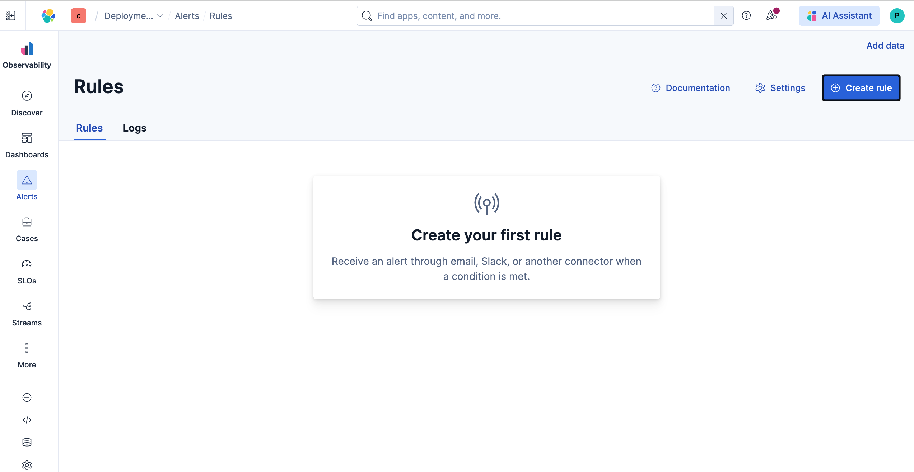
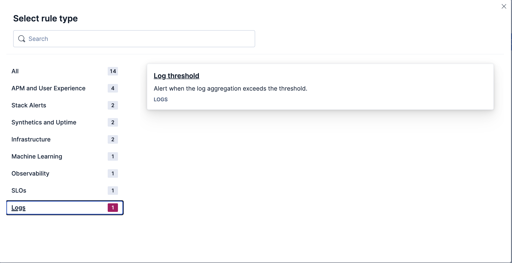
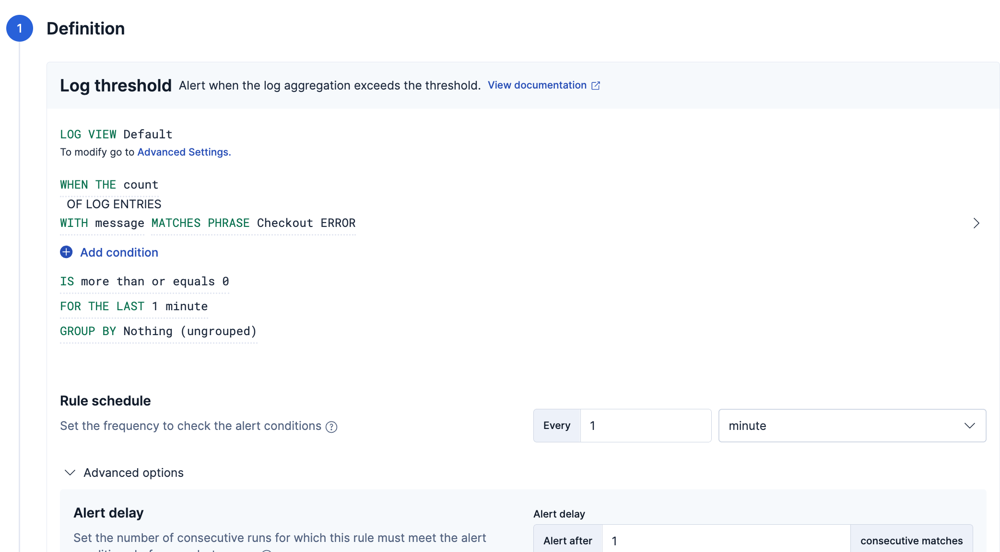

## Step-1: Install Node.js

```
curl -fsSL https://rpm.nodesource.com/setup_18.x | sudo bash -
sudo yum install -y nodejs
```

### Next we’ll do 3 things in Elastic:

1. Ingest /var/log/demo-app.log into Elastic

2. Verify you can search “Checkout …” in Logs/Discover

3. Create an alert rule → trigger it → create a case

### Ingest the log file via Fleet (Custom Logs)

In Kibana

Go to:

Fleet → Agent Policies → (your EC2 policy)

Then:

Click Add Integration

Search → Custom Logs

Configure:

Log file path

```
/var/log/demo-app.log
```

Dataset name

```
elastic-demo-app
```

Save → wait 30–60 seconds


1) In Elastic Cloud / Kibana: get your APM endpoint + auth

A) Find the APM Server URL

In Kibana:

Go to Observability → APM

Look for “Add data” / “Add Elastic APM” and it will show you the APM Server URL (the “host:port” the agent should send to). 

On Elastic Cloud, this is typically already provisioned; you mainly copy the APM endpoint.

B) Create an APM Agent API key (recommended)

In Kibana:

Go to Applications (APM) → Settings → Agent keys

Click Create APM agent key

Give it a name, and assign at least:

Ingest (event:write) (required to send events)

optionally Agent configuration (config_agent:read) (only needed if you’ll use central config)

Copy the API key value — you’ll use it on EC2.

You can use a secret token instead, but Elastic notes it’s plaintext and only secure with TLS.
(Elastic Cloud uses HTTPS/TLS, so that’s fine — but API keys are generally nicer to manage.)

2) On EC2: install the Node APM agent

3) Update your app code (APM MUST be first)

Create/update server.js like this (note: the require("elastic-apm-node").start(...) line must come before http is required):

```
// APM must be the first thing that runs
require("elastic-apm-node").start({
  serviceName: "checkout-demo",
  serverUrl: process.env.ELASTIC_APM_SERVER_URL,
  apiKey: process.env.ELASTIC_APM_API_KEY, // recommended
  environment: "dev",
});

const http = require("http");

const server = http.createServer((req, res) => {
  const delay = Math.random() * 2000;

  setTimeout(() => {
    if (Math.random() < 0.1) {
      console.error("Checkout ERROR at", new Date());
      res.writeHead(500);
      res.end("Checkout failed");
    } else {
      console.log("Checkout success at", new Date());
      res.writeHead(200);
      res.end("Checkout OK");
    }
  }, delay);
});

server.listen(3000, () => console.log("Demo app running on port 3000"));

```

(Elastic’s Node agent is the official way to send APM data from Node services. )

4) Run it with the right env vars

Export the endpoint + API key you copied from Kibana:

```
export ELASTIC_APM_SERVER_URL="https://<your-apm-endpoint>:443"
export ELASTIC_APM_API_KEY="<your_apm_agent_api_key>"

node server.js
```

(If you chose secret token instead of API key, you’d set secretToken / ELASTIC_APM_SECRET_TOKEN — same idea.)

5) Generate traffic (so charts light up)

From the same EC2:

```
while true; do
  curl -s -o /dev/null -w "%{http_code}\n" http://localhost:3000/
  sleep 0.2
done
```

You should see some 200 and occasional 500.

6) See it in Kibana (the “great visuals” part)

In Kibana:

Observability → APM

You should see a service named checkout-demo

Click it and you’ll get:

Throughput (requests/min)

Latency (avg / p95 / p99 depending on view)

Failed transaction rate (your ~10% 500s)

## Create Alerts

1) Go to Alerts

In Kibana:

Observability → Alerts → Create rule

2) Choose rule type






3) Define the condition

Configure:

Index / Data view

Use your logs index (likely logs-* or whatever Discover showed)

Condition

```
WHEN count() OF logs
WHERE message contains "Checkout ERROR"
IS ABOVE 0
FOR THE LAST 1 minute
```

This triggers whenever a checkout failure appears.



## Run traffic again:

```
while true; do curl -s http://localhost:3000 > /dev/null; sleep 0.2; done
```

Within ~1 minute the rule should fire.

## View the Case

Go to:

Observability → Cases

You should see:

“Checkout failures detected”

## Wrap-up and Clean

1) Stop the running Node app

If your app is still running in the current terminal, press:

```
CTRL + C
```

2) Make sure no Node processes remain

Run:

```
ps aux | grep node | grep -v grep
```

If you see any node server.js still running, stop them:

```
pkill -f server.js
```

(Or kill individually:)

```
kill -9 <PID>
```

3) Confirm port 3000 is free

```
sudo ss -ltnp | grep :3000 || echo "Port 3000 is free"
```

You want:

Port 3000 is free

4) (Optional) Stop traffic generator

If you still have the curl loop running in another terminal:

```
CTRL + C
```

5) (Optional) Remove temporary environment variables

Only needed if you exported earlier:

```
unset ELASTIC_APM_SERVER_URL
unset ELASTIC_APM_API_KEY
```
