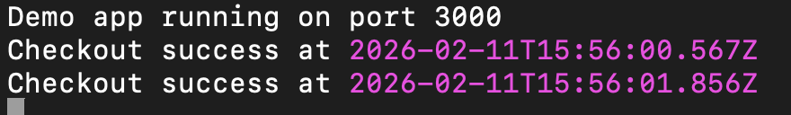

## Step-1: Install Node.js

```
curl -fsSL https://rpm.nodesource.com/setup_18.x | sudo bash -
sudo yum install -y nodejs
```

## Step-2: Create the demo app

```
mkdir -p ~/demo-app && cd ~/demo-app
npm init -y
npm i express pino

```

### Create app.js:

```
const http = require("http");

const server = http.createServer((req, res) => {
  const delay = Math.random() * 2000; // random latency

  setTimeout(() => {
    if (Math.random() < 0.1) {
      console.error("Checkout ERROR at", new Date());
      res.writeHead(500);
      res.end("Checkout failed");
    } else {
      console.log("Checkout success at", new Date());
      res.writeHead(200);
      res.end("Checkout OK");
    }
  }, delay);
});

server.listen(3000, () => {
  console.log("Demo app running on port 3000");
});


```

### Install dependencies

```
npm init -y
npm i express pino

```


## Step 3 — Run the app

```
node app.js
```

## Step 4 — Test from browser

Open:

http://{your-ip-address}:3000

### You can see things like below in your EC2 instance



### See things like this in your browser


